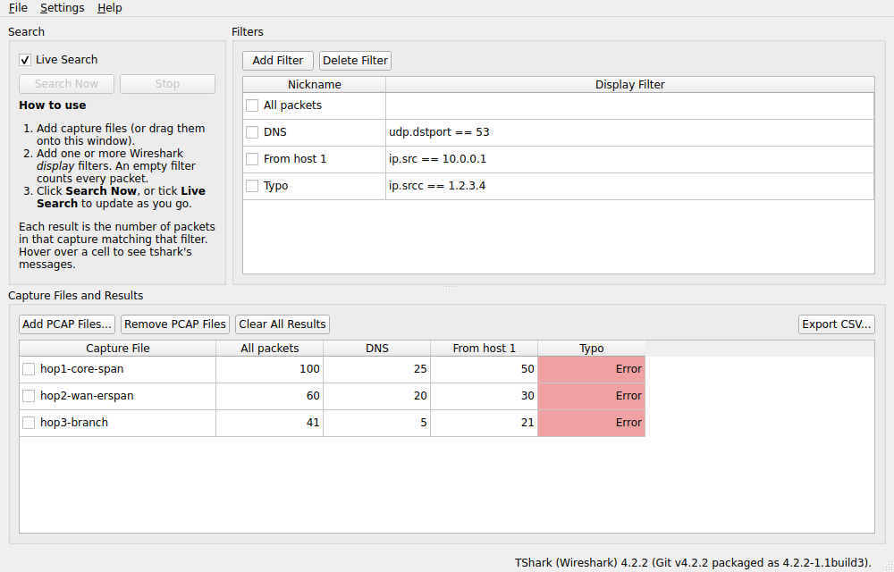

# MultiPCAPSearch

Apply several Wireshark display filters to several capture files at once, and see how many packets in each capture match each filter, all in one table.



## Why?

Imagine you're a network engineer following a flow of traffic across many devices. You have PCAPs from SPAN/RSPAN/ERSPAN sessions at each hop, and you want to find where drops happen. Some hops encrypt the traffic inside GRE or ESP, so those captures need a different filter from the plaintext ones.

Load all your PCAPs here and make two filters: one for the plaintext source/destination IPs, and one for the tunnel endpoints. You can then see at a glance how many packets in each PCAP match each filter. No more opening ten copies of Wireshark, keeping their display filters in sync, and writing down each "Displayed" packet count.

## Download

Get the latest build from the [Releases page](https://github.com/sbrown7792/MultiPCAPSearch/releases/latest):

| Platform | File | How to run |
|---|---|---|
| Windows 10/11 (x64) | `MultiPCAPSearch-windows-x64.zip` | Unzip anywhere, run `MultiPCAPSearch.exe` |
| macOS 12+ (Apple Silicon and Intel) | `MultiPCAPSearch-macos-universal.dmg` | Drag the app to Applications. The app is unsigned, so the first time, right-click it and choose **Open** |
| Linux (x86_64) | `MultiPCAPSearch-linux-x86_64.AppImage` | `chmod +x` it and run it |

**You also need Wireshark installed**, because MultiPCAPSearch uses its `tshark` command-line tool for the actual filtering. The app looks for `tshark` in this order:

1. the path you set with **Settings > Locate tshark...**
2. next to the MultiPCAPSearch executable
3. your `PATH`
4. the standard Wireshark install location (`C:\Program Files\Wireshark`, `/Applications/Wireshark.app`, `/usr/bin`, ...)

The status bar shows which tshark version is being used.

## Usage

1. **Add PCAP Files...** (or drag capture files onto the window, or pass them on the command line). A single file prompts for a friendly name; you can rename any capture later by double-clicking its name.
2. **Add Filter**, give it a nickname, and type a Wireshark *display* filter (e.g. `ip.addr == 10.1.1.1 && tcp.port == 443`). An empty filter counts every packet.
3. Click **Search Now**, or tick **Live Search** to re-run automatically whenever you add a capture or edit a filter.

Each cell shows how many packets in that capture match that filter.

- **Red** cells are errors, such as an invalid filter or an unreadable file. **Amber** cells completed but tshark printed a warning (e.g. a truncated capture). Hover over a cell to read tshark's message.
- Searches run in parallel, one tshark process per CPU core by default (change this in **Settings > Parallel Searches...**). **Stop** cancels everything in flight.
- Results are cached per capture file and filter, so re-running only filters what changed. The cache is dropped automatically if a capture file changes on disk, or manually with **Clear All Results**.
- **Export CSV...** saves the results table.
- Filters, window layout and the last folder you browsed are remembered between sessions.

## Building from source

Requirements: CMake 3.19+, a C++17 compiler, and Qt 6.2 or newer (Widgets; Test for the unit tests).

```sh
cmake -S . -B build -DCMAKE_BUILD_TYPE=Release -DCMAKE_PREFIX_PATH=/path/to/Qt/6.x/<compiler>
cmake --build build
ctest --test-dir build --output-on-failure   # needs tshark; set MULTIPCAPSEARCH_TSHARK to point at a specific one
```

Qt Creator can open `CMakeLists.txt` directly. Release binaries are built by [GitHub Actions](.github/workflows/build.yml) for every `v*` tag.

## Changes since v0.1-alpha

- Fixed a crash when adding a PCAP while a search was running ([#2](https://github.com/sbrown7792/MultiPCAPSearch/issues/2)). Searches no longer touch the UI from background threads.
- The file dialog reopens in the last folder you used ([#1](https://github.com/sbrown7792/MultiPCAPSearch/issues/1)).
- The window now resizes properly (a known issue in v0.1-alpha).
- Ported to Qt 6 and CMake. Runs on Windows, macOS and Linux, with prebuilt binaries for each.
- Uses your installed Wireshark instead of a bundled 2022-era copy, and calls tshark directly instead of going through PowerShell.
- New: add several files at once, drag and drop, Stop button, CSV export, empty filter = count all, remembered filters, configurable parallelism, and warnings/errors shown per cell.

## License

Copyright (C) 2022-2026 sbrown7792 and MultiPCAPSearch contributors.

MultiPCAPSearch is free software: you can redistribute it and/or modify it under the terms of the GNU Affero General Public License as published by the Free Software Foundation, either version 3 of the License, or (at your option) any later version. See [LICENSE](LICENSE) for the full text.

The release binaries include the Qt libraries, which are used under the GNU LGPL v3. MultiPCAPSearch runs Wireshark's `tshark` (GPL-2.0-or-later) as a separate program; it does not include or link to it.
